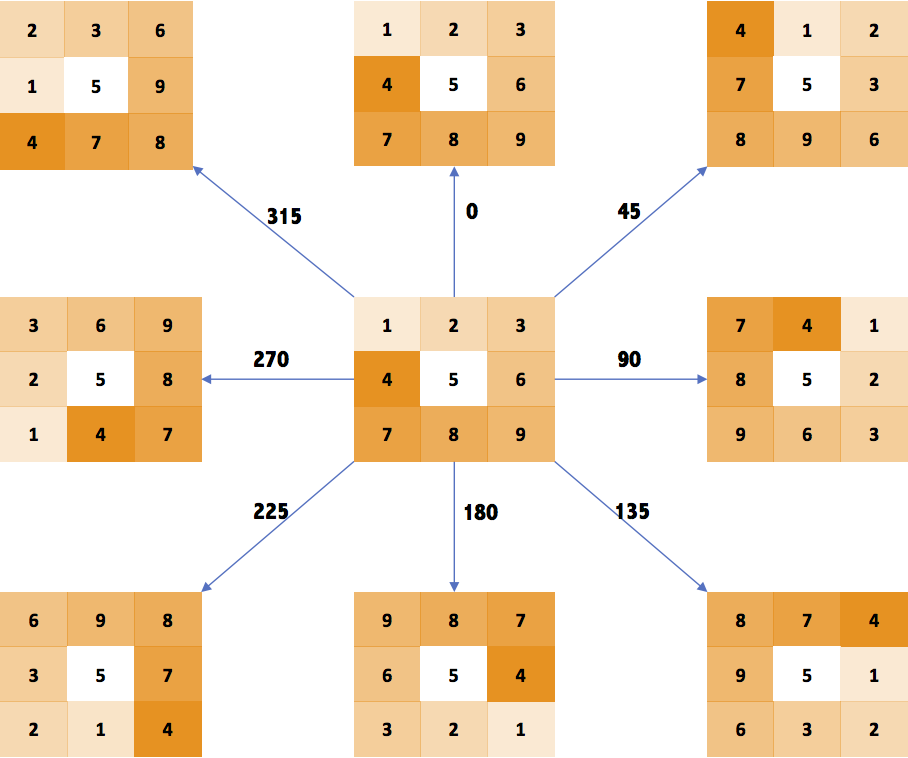
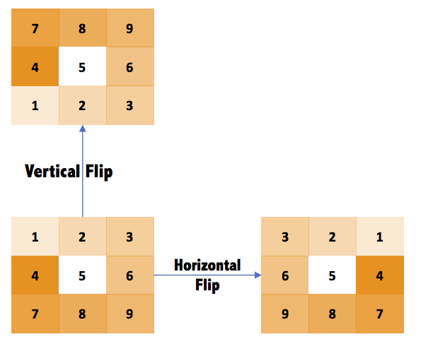
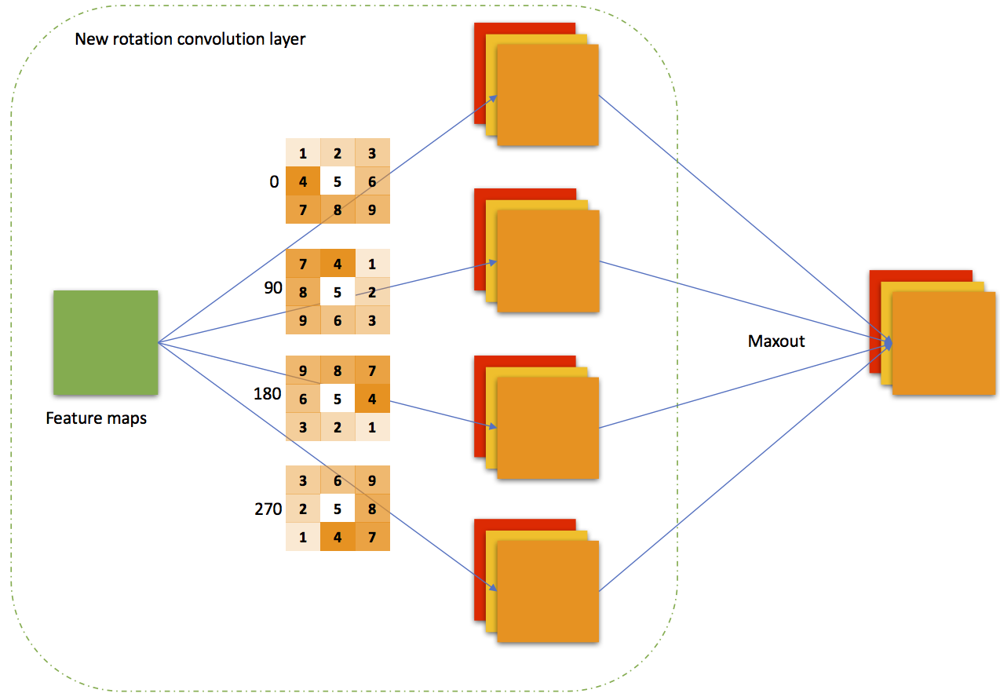
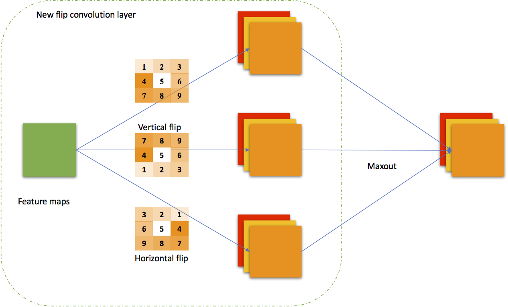
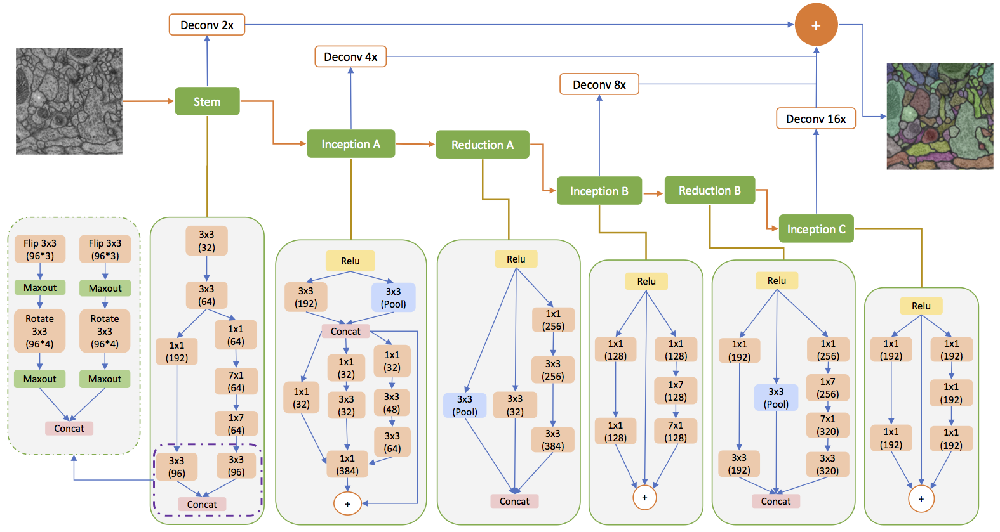

# Rotation and Flip Invariant CNN

Caffe implementation of Rotation and Flip Invariant Convolutional Layer is implemented in caffe_3d @ 9686972.

## Prepare data

[Cremi data](https://cremi.org/data/) is used for training model.
After downloading the data, update the content of train_file and test_file in seg_cremi folder.

## How to run

First define caffe path in train.sh in seg_cremi baseline folder and newmodel folder.

In seg_cremi, there are two folders: baseline and newmodel. You can run train.sh to train the model in case you have installed caffe_3d and prepared the data.

## Kernel Rotation operation:
The kernels in convolutional layers are rotated at eight angles:

## Kernel Rotation operation:
The kernels in convolutional layers are flipped both horizontally and vertically:

## Rotation Invariance with Maxout

## Flip Invariance with Maxout

## Model used

## Author

[Hongyang Gao](http://eecs.wsu.edu/~hgao/)
